# Level 0 

Mục tiêu của level này là đăng nhập vào trò chơi bằng cách sử dụng SSH. Kết nối với 
- Host: `bandit.labs.overthewire.org` trên port `2220`
- Username: `bandit0`
- Password: `bandit0`

Ta có câu lệnh kết nối SSH với port riêng:
```
ssh username@hostname -p [port]
```

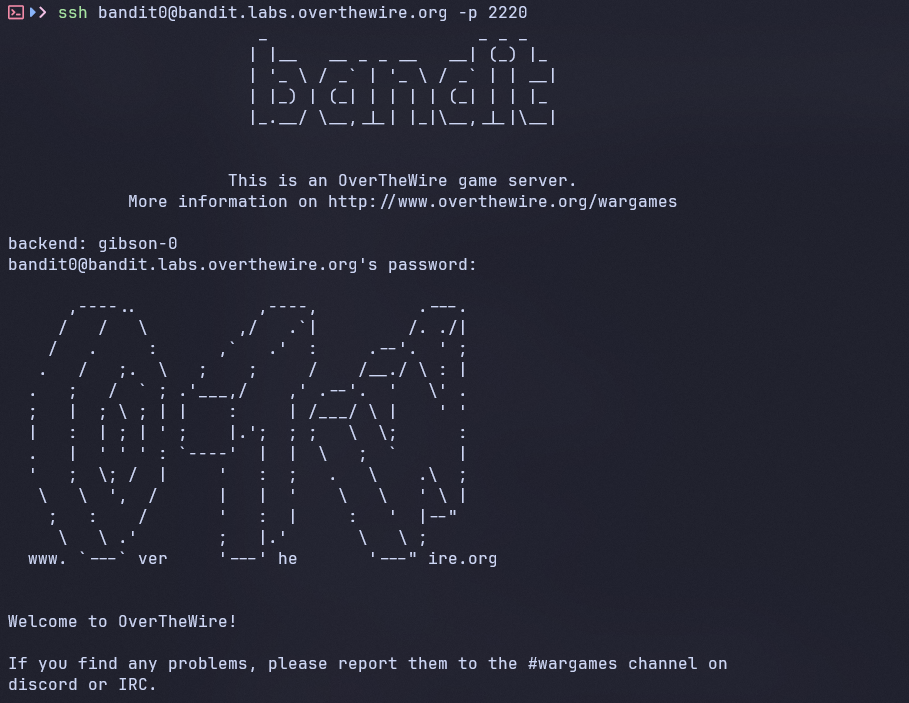

# Level 0 -> Level 1

Mật khẩu cho level tiếp theo được lưu trong file `readme` nằm trong thư mục chính. Sử dụng mật khảu này để đăng nhập vào bandit1 sử dụng SSH

Sử dụng `ls` để liệt kê danh sách tệp tin và thư mục
- `ls`: Liệt kê các tệp/thư mục trong thư mục hiện tại (không bao gồm tệp ẩn).
- `ls -a`: Liệt kê tất cả tệp, bao gồm cả các tệp ẩn (tên bắt đầu bằng dấu .).
- `ls -l`: Hiển thị danh sách dài (chi tiết về quyền, người sở hữu, kích thước, thời gian).

Sau đó, sử dụng `cat` để đọc, hiển thị nội dung tệp tin
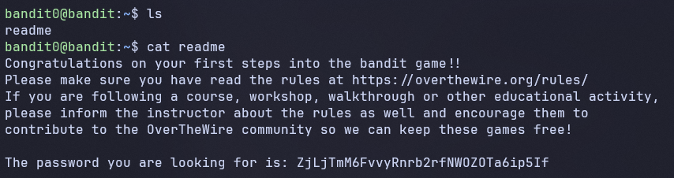

-> Password: `ZjLjTmM6FvvyRnrb2rfNWOZOTa6ip5If`

# Level 1 -> Level 2

Mật khẩu cho level tiếp theo được lưu trong file `-` nằm trong thư mục chính

Sử dụng lệnh SSH để kết nối tới server với user: `bandit1` và password tìm được ở level trước

Sử dụng lệnh `ls`, kết quả hiển thị một file có tên `-`

Trong Linux, kí tự `-` thường được hiểu là `option (tham số)` của lệnh, không phải tên file. Do đó không thể truy cập file theo cách thông thường

Cách xử lí:
- Cách 1: Sử dụng đường dẫn tương đối

```
cat ./-
```

`./` đại diện cho thư mục hiện tại
-> Giúp hệ thống hiểu rõ `-` là tên file

- Cách 2: Sử dụng kí hiệu `--`

```
cat -- -
```
`--` báo hiệu kết thúc các option
-> Các tham số phía sau sẽ được hiểu là tên file

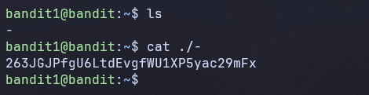

-> Password: `263JGJPfgU6LtdEvgfWU1XP5yac29mFx`

# Level 2 -> Level 3

Mật khẩu cho level tiếp theo được lưu trong file
```
-- spaces in this filename --
```
nằm ở trong thư mục chính

Tên file chứa `dấu cách (spaces)` -> Shell sẽ hiểu mỗi phần là một argument riêng biệt

Ví dụ:
```
cat --spaces in this filename--
```
Shell sẽ hiểu thành:
- `--spaces`
- `in`
- `this`
- `filename--`

Cách xử lí: Để xử lí tên file chứa dấu cách, cần gom toàn bộ tên file thành một chuỗi
-> Dùng dấu ngoặc kép `" "`

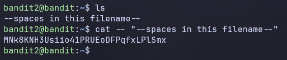

-> Password: `MNk8KNH3Usiio41PRUEoDFPqfxLPlSmx`

# Level 3 -> Level 4

Mật khẩu cho level tiếp theo được lưu trong 1 file ẩn trong thư mục `inhere`

Sử dụng `ls -a` để liệt kê tất cả các tệp, bao gồm cả tệp ẩn

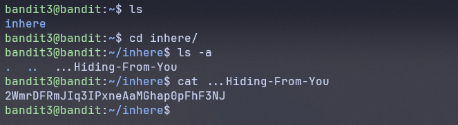

-> Password: `2WmrDFRmJIq3IPxneAaMGhap0pFhF3NJ`

# Level 4 -> Level 5

Mật khẩu cho level tiếp theo được lưu trong `file duy nhất có thể đọc được (human-readable)` nằm trong thư mục `inhere`

Di chuyển vào thư mục `inhere` và liệt kê các file, kết quả sẽ thấy nhiều file dạng:

```
-file00
-file01
-file02
...
```

- Các file đều có tên bắt đầu bằng `-` -> dễ bị hiểu là option
- Không biết file nào chứa nội dung `readable`
- Một số file là `binary` -> Nếu `cat` sẽ làm terminal bị loạn

Cách xử lí:
- Xác định loại file bằng cách sử dụng lệnh `file` để kiểm tra
  
-> Kết quả sẽ có dạng: ASCII text / data / binary

- `cat` file ASCII text để tìm được mật khẩu

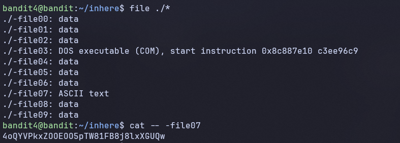

-> Password: `4oQYVPkxZOOEOO5pTW81FB8j8lxXGUQw`

# Level 5 -> Level 6

Mật khẩu cho level tiếp theo được lưu trữ trong một tệp tin nằm ở đâu đó trong thư mục `inhere` và có tất cả các thuộc tính sau:

- `human-readable`
- `1033 bytes in size`
- `not executable`

Vì thư mục `inhere` chứa nhiều thư mục con và file nên không thể tìm thủ công. Do đó cần lọc theo:
- type: file thường
- size: 1033 bytes
- permission: không `executable`

Sau đó kiểm tra human-readable

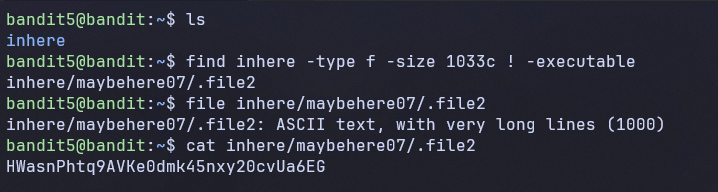


```
find inhere -type f -size 1033c ! -executable
```

- `inhere` : thư mục tìm kiếm
- `-type f`: chỉ lấy file
- `-size 1033c`: 1033 bytes
- `! -executable`: không có quyền thực thi

```
file inhere/maybehere07/.file2
```
-> `ASCII text`

-> Password: `HWasnPhtq9AVKe0dmk45nxy20cvUa6EG`

# Level 6 -> Level 7

Mật khẩu cho level tiếp theo được lưu trữ ở đâu đó trên server và có các thuộc tính sau:
- `Owner (user)`: bandit7
- `Group`: bandit6
- `size:` 33 bytes

Tìm file với `find`
```
find / -type f -user bandit7 -group bandit6 -size 33c 2>/dev/null
```
- `/`: Tìm toàn bộ hệ thống
- `-type f`: Chỉ file
- `-user bandit7`: owner là bandit7
- `-group bandit6`: group là bandit6
- `size 33c`: đúng 33 bytes
- `2>/dev/null`: ẩn lỗi permission denied

Sau khi tìm đường đường dẫn file, sử dụng `cat` để đọc được mật khẩu

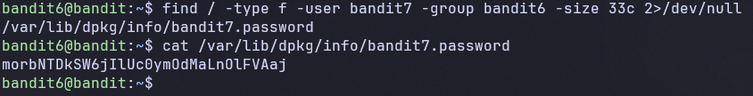

-> Password: `morbNTDkSW6jIlUc0ymOdMaLnOlFVAaj`

# Level 7 -> Level 8

Mật khẩu của level tiếp theo được lưu trong file `data.txt` nằm cạnh từ `millionth`

Vì file `data.txt` chứa rất nhiều dòng dữ liệu nên không thể tìm thủ công

Cách xử lí: Tìm dòng có chứa từ `millionth` và lấy giá trị nằm cạnh từ đó (chính là password)

Sử dụng lệnh `grep` để tìm kiếm các mẫu văn bản, chuỗi kí tự hoặc biểu thức chính quy bên trong tập tin
```
grep "millionth" data.txt
```

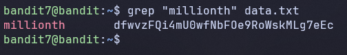

-> Password: `dfwvzFQi4mU0wfNbFOe9RoWskMLg7eEc`

# Level 8 -> Level 9

Mật khẩu cho level tiếp theo được lưu trong file `data.txt` và là dòng duy nhất chỉ xuất hiện một lần

Vì file `data.txt` chứa rất nhiều dòng:
- Có dòng bị lặp lại nhiều lần
- Chỉ có 1 dòng duy nhất xuất hiện đúng 1 lần

Vì vậy, cần loại bỏ các dòng trùng và tìm dòng `unique`

*Note*: Lệnh `uniq` chỉ hoạt động đúng khi các dòng giống nhau phải đứng cạnh nhau -> Cần sort trước
```
sort data.txt | uniq -u
```
- `sort data.txt`: Sắp xếp các dòng
- `uniq -u`: Chỉ giữ lại dòng xuất hiện đúng một lần

Ngoài ra còn một số biến thể của `uniq`:
- Lọc dòng duy nhất: `uniq file.txt` (chỉ hiển thị 1 dòng đại diện cho các dòng liền kề giống nhau).
- Đếm số lần xuất hiện: `uniq -c file.txt` (đếm số lần mỗi dòng xuất hiện).
- Chỉ hiển thị dòng trùng lặp: `uniq -d file.txt`.
- Chỉ hiển thị dòng độc nhất (không trùng): `uniq -u file.txt`.
- Bỏ qua phân biệt chữ hoa/thường: `uniq -i file.txt`.

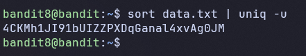

-> Password: `4CKMh1JI91bUIZZPXDqGanal4xvAg0JM`

# Level 9 -> Level 10

Mật khẩu cho level tiếp theo được lưu trữ trong file `data.txt` 
- Nằm trong một chuỗi có thể đọc được (human-readable string)
- Đứng sau nhiều kí tự `=`

Sau khi `cat`, chủ yếu file `data.txt` chứa:
- Các `binary data`
- Chỉ có một vài đoạn text có thể đọc được

Cách xử lí:
- Đầu tiên phải trích xuất các chuỗi readable: `strings data.txt`

-> Lệnh này sẽ kich ra các chuỗi text từ file binary

- Sau đó tìm các chuỗi có chứa dấu `=`: 
`grep "==="`

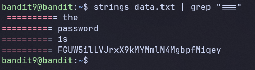

-> Password: `FGUW5ilLVJrxX9kMYMmlN4MgbpfMiqey`

# Level 10 -> Level 11

Mật khẩu cho level tiếp theo được lưu trong file `data.txt`, nơi chứa dữ liệu được mã hóa `base64`

Sau khi `cat` file data.txt, ta thấy nội dung có dạng: `VGhpcyBpcyBlbmNvZGVkIHN0cmluZw==`

Đây là `Base64 encoding`, vì vậy ta sử dụng lệnh sau để decode:
```
base64 -d data.txt
```
- `-d`: decode
- Chuyển từ Base64 -> Plaintext

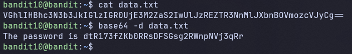

-> Password: `dtR173fZKb0RRsDFSGsg2RWnpNVj3qRr`

# Level 11 -> Level 12

Mật khẩu cho level tiếp theo được lưu trong file `data.txt`, nơi tất cả chữ cái thường (a-z) và chữ hoa (A-Z) đã bị xoay 13 vị trí (rotated by 13 positions)

Sau khi `cat` file data.txt, ta thấy nội dung có dạng:
`Gur cnffjbeq vf 7k16JArUVv5LxVuJfsSVdbbtaHGlw9D4`

Đây là `ROT13 cipher`
- Là một dạng `Caesar cipher`
- Dịch mỗi chữ cái 13 vị trí

```
cat data.txt | tr 'A-Za-z' 'N-ZA-Mn-za-m'
```
- `tr`: translate (chuyển đổi kí tự)
- `A-Za-z`: toàn bộ chữ cái
- `N-ZA-Mn-za-m`: mapping ROT13

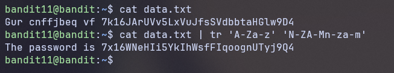

-> Password: `7x16WNeHIi5YkIhWsfFIqoognUTyj9Q4`

# Level 12 -> Level 13

Mật khẩu cho level tiếp theo được lưu trong file `data.txt`, là một file đã bị `hexdump` và nén nhiều lớp

Cách xử lí: Đầu tiên phải convert hexdump -> binary, sau đó unpack từng lớp một

- Tạo workspace an toàn:
```
mktemp -d
```
- Di chuyển vào thư mục vừa tạo
```
cat /tmp/tmp.yjUJUYRhpb
```
- Copy file vào workspace
```
cp ~/data.txt
```
- Convert hexdump -> binary
```
xxd -r data.txt > data.bin
```
`xxd`: hexdump tool

`-r`: reverse
- Kiểm tra `file type` của `data.bin`
```
file data.bin
```
-> data.bin: gzip compressed data
- Đổi tên tệp từ `.bin` sang `.gz` sau đó unzip
```
mv data.bin data.gz
gunzip data.gz
```
-> Thu được file mới `data`
- Kiểm tra file type của `data`
-> data: bzip2 compressed data
- Đổi tên tệp từ `.gz` sang `.bz2` sau đó unzip

-> Thu được file `data` có file type: data: gzip compressed data

- Thực hiện lại đổi tên và unzip thu được file `tar`
```
mv data data.tar
tar -xf data.tar
```
...

- Lặp lại cho tới khi tìm được file ASCII text thì `cat` và thu được password

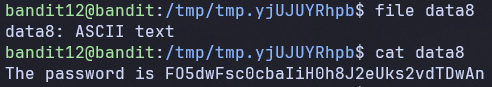

-> Password: `FO5dwFsc0cbaIiH0h8J2eUks2vdTDwAn`

# Level 13 -> Level 14

Mật khẩu cho level tiếp theo được lưu trong `/etc/bandit_pass/bandit14` và chỉ user `bandit14` đọc được. 

Ở level này bạn không nhận được mật khẩu tiếp theo, nhưng nhận được 1 khóa SSH riêng tư (private SSH key) được sử dụng để đăng nhập vào cấp độ tiếp theo.

Đăng nhập vào server với user `bandit13` và tìm được file `sshkey.private` trong thư mục chính.

Đã biết vị trí của file `sshkey.private`, chuyển nó sang máy của mình.

```
1 bandit13@bandit:~$ ls
2 sshkey.private
3 bandit13@bandit:~$ exit
4 logout
5 Connection to bandit.labs.overthewire.org closed.
```
Sử dụng lệnh `scp` để copy file `sshkey.private` từ server về máy của mình
```
scp -P 2220 bandit13@bandit.labs.overthewire.org:~/sshkey.private .
```
`-P 2220`: port
`bandit13@...`: server
`:~/sshkey.private`: file trên server
`.`: thư mục local

SSH bằng private ssh key, ta nhận được cảnh báo `Permissions 0640 for 'sshkey.private' are too open.`
- File private key đang quá "open"
- SSH từ chối sử dụng key vì không an toàn

Quyền hiện tại: 0640
- Owner: read + write
- Group: read
- Others: none

SSH yêu cầu chỉ Owner được phép, vì vậy ta phải sửa lại quyền cho file `sshkey.private`
```
chmod 600 sshkey.private
```
Chạy lại và login thành công vào server
```
ssh -i sshkey.private bandit14@bandit.labs.overthewire.org -p 2220
```

Lấy mật khẩu
```
cat /etc/bandit_pass/bandit14
```

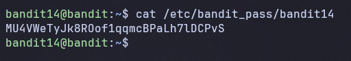

-> Password: `MU4VWeTyJk8ROof1qqmcBPaLh7lDCPvS`

# Level 14 -> Level 15

Mật khẩu cho level tiếp theo được lấy bằng cách submit password của level hiện tại tới `port 30000` trên `localhost`

Kết nối tới port 30000 bằng `nc`

```
nc localhost 30000
```

Dán password vào và lấy được password cho level tiếp theo

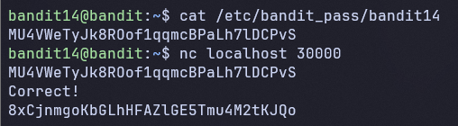

-> Password: `8xCjnmgoKbGLhHFAZlGE5Tmu4M2tKJQo`

# Level 15 -> Level 16

Mật khẩu cho level tiếp theo được lấy bằng cách submit password của level hiện tại tới `port 30001` trên `localhost` sử dụng mã hóa `SSL/TLS`

Sử dụng `openssl` để làm việc với mã hóa và giao thức SSL/TLS
```
openssl s_client -connect localhost:30001
```

Dán password vào và lấy được password cho level tiếp theo

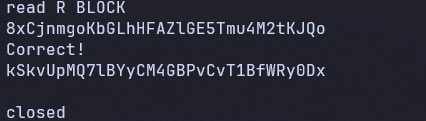

-> Password: `kSkvUpMQ7lBYyCM4GBPvCvT1BfWRy0Dx`

# Level 16 -> Level 17

Thông tin đăng nhập cho level tiếp theo có thể lấy bằng cách gửi mật khẩu hiện tại tới 1 port trên localhost trong phạm vi từ `31000 tới 32000`.

Đầu tiên, tìm xem port nào có server đang `lắng nghe`. Sau đó tìm xem cái nào hỗ trợ `SSL/TLS`

Chỉ có 1 server sẽ cung cáp thông tin đăng nhập tiếp theo, các server khác sẽ chỉ gửi lại cho bạn bất cứ thứ gì bạn gửi đến.

- Đầu tiên sử dụng `nmap` để scan port xem port nào đang `open`
```
nmap -p 31000-32000 localhost
```

Kết quả:
```
PORT      STATE SERVICE
31046/tcp open  unknown
31518/tcp open  unknown
31691/tcp open  unknown
31790/tcp open  unknown
31960/tcp open  unknown
```

- Tiếp theo xác định port hỗ trợ SSL/TLC bằng cách test port thường (nc)

Ví dụ: `nc localhost 31046`
-> Nếu chỉ echo lại input thì bỏ

Kết quả: Lọc được còn lại 2 port `31581` và `31790`

- Test TLS với từng port
```
cat /etc/bandit.pass/bandit16 | openssl s_client -connect localhost:31790
```

Kết quả: Thu được private key
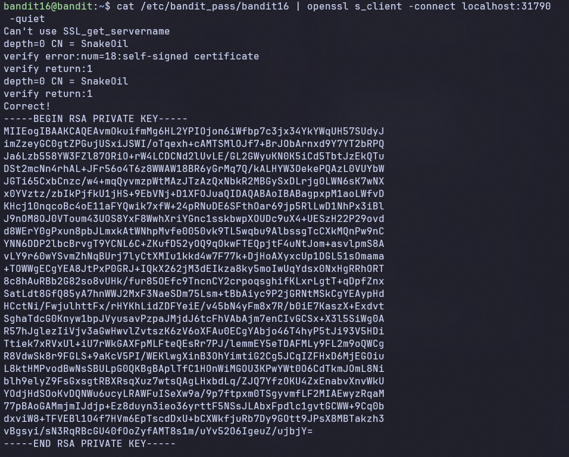

Lưu lại private key vào file và set quyền cho key
```
chmod 600 key17
```

SSH bằng private key
```
ssh -i key17 bandit17@bandit.labs.overthewire.org -p 2220
```

Lấy mật khẩu

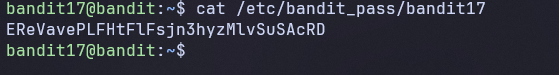

-> Password: `EReVavePLFHtFlFsjn3hyzMlvSuSAcRD`

# Level 17 -> Level 18

Có 2 file trong thư mục chính: `passwords.old` và `passwords.new`

Mật khẩu cho level tiếp theo nằm trong `passwords.new` và có 1 dòng đã bị thay đổi giữa `passwords.old` và `passwords.new`

Sử dụng lệnh `diff` để so sánh 2 tệp văn bản theo từng dòng, hiển thị các điểm khác biệt giữa chúng.

```
diff passwords.old passwords.new
```

Thu được kết quả:
```
bandit17@bandit:~$ diff passwords.old passwords.new
42c42
< 390zFj2NETFVZkqYw8UEFdN6h40oGVtT
---
> x2gLTTjFwMOhQ8oWNbMN362QKxfRqGlO
```

`<`: dòng trong file `old`
`>`: dòng trong file `new`

-> Password: `x2gLTTjFwMOhQ8oWNbMN362QKxfRqGlO`

Sử dụng mật khẩu này để SSH vào level tiếp theo, ta thấy trên màn hình hiển thị

```
Byebye !
Connection to bandit.labs.overthewire.org closed.
```

Đây không phải là sai password mà là cơ chế `auto logout` của level tiếp theo

# Level 18 -> Level 19

Mật khẩu cho level tiếp theo được lưu trong file `readme` trong thư mục chính, nhưng ai đó đã thay đổi tệp `.bashrc` để đăng xuất bạn ra khi bạn đăng nhập với SSH

`.bashrc` là một tệp kịch bản (script) ẩn nằm trong thư mục gốc (~/.bashrc), tự động chạy mỗi khi bạn mở một cửa sổ terminal mới (non-login shell) trên Linux/macOS.

Trong level này, `.bashrc` bị sửa thành kiểu:
```
echo "Byebye!"
exit
```
Nghĩa là:
- Vừa login vào
- `.bashrc` chạy
- in ra "Byebye!"
- thoát

Vì vậy, để tránh `.bashrc` thì mình sẽ không mở shell mà `cat` trực tiếp trong cùng một câu lệnh để đọc file luôn

```
ssh bandit18@bandit.labs.overthewire.org -p 2220 cat readme
```

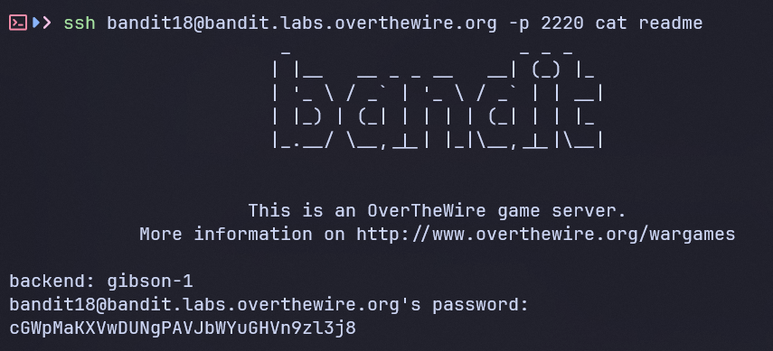

-> Password: `cGWpMaKXVwDUNgPAVJbWYuGHVn9zl3j8`

# Level 19 -> Level 20

Để truy cập level tiếp theo, cần sử dụng tập lệnh `setuid` trong thư mục chính. Mật khẩu của level này có thể được tìm thấy trong `/etc/bandit_pass` sau khi bạn sử dụng tập lệnh `setuid`

`SetUID` là một quyền cho phép file thực thi chạy với quyền của chủ sở hữu file, thay vì người dùng hiện tại
- Nếu file thuộc về `bandit20`
- Và có SetUID -> khi `bandit19` chạy file đó, chương trình sẽ chạy với quyền `bandit20`

Liệt kê chi tiết các file trong thư mục chính

```
bandit19@bandit:~$ ls -l
total 16
-rwsr-x--- 1 bandit20 bandit19 14888 Apr  3 15:17 bandit20-do
```

Trong file `bandit20-do` có quyền `rws` -> Đây là file SetUID có owner: `bandit20`

Chạy thử file này

```
bandit19@bandit:~$ ./bandit20-do
Run a command as another user.
  Example: ./bandit20-do whoami
```

thông báo này cho biết: `bandit20-do` là chương trình cho phép chạy lệnh với quyền của user khác

```
bandit19@bandit:~$ ./bandit20-do whoami
bandit20
```

thông thường `whoami` -> `bandit19`, nhưng khi chạy qua `bandit20-do` -> `bandit20`. Điều này chứng minh lệnh được thực thi với quyền `bandit20`

Giờ chạy lệnh để đọc password

```
./bandit20-do cat /etc/bandit_pass/bandit20
```

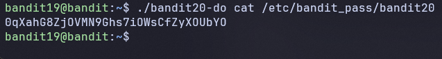

-> Password: `0qXahG8ZjOVMN9Ghs7iOWsCfZyXOUbYO`

# Level 20 -> Level 21

Sử dụng chương trinh SetUID để lấy password của level tiếp theo

Chương trình này sẽ:
- Kết nối tới `localhost` tại một `port` do người dùng chỉ định
- Đọc một dòng dữ liệu từ kết nối
- So sánh với password của level hiện tại `(bandit20)`
- Nếu đúng thì trả về password của `bandit21`

Để khai thác, ta cần:
- Tạo một server (listener) trên máy local, server này sẽ gửi password bandit20 khi có kết nối
- Sau đó sẽ cho chương trình SetUID kết nối vào server đó

Sử dụng `nc` để tạo một `listener` lắng nghe các kết nối đến. Để `nc` gửi mật khẩu, ta sử dụng lệnh `echo` và chuyển tiếp nó vào `nc`. Cờ `-n` để ngăn các kí tự xuống dòng trong đầu vào. Cuối cùng, cho phép tiến trình chạy ngầm bằng lệnh `&`

```
bandit20@bandit:~$ echo -n '0qXahG8ZjOVMN9Ghs7iOWsCfZyXOUbYO' | nc -l -p 1234 &
```

Chạy chương trình SetUID với port `1234` để kết nối tới server netcat
```
./suconnect 1234
```

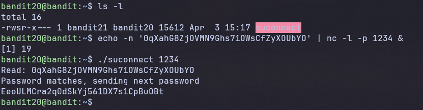

-> Password: `EeoULMCra2q0dSkYj561DX7s1CpBuOBt`

# Level 21 -> Level 22

Một chương trình đang chạy tự động định kì từ `cron`, trình lập lịch tác vụ dựa trên thời gian. Hãy xem cấu hình trong `/etc/cron.d/` và xem lệnh nào đang được thực thi

Như đã mô tả, `cronjob` là các chương trình chạy tự động theo định kì. Trong Linux, có nhiều thư mục có thể chứa các cronjob này: cron.d, cron.daily, cron.hour, cron.monthly, crontab, cron.weekly.

Các thư mục này chứa các tệp hướng dẫn cách chạy chương trình.

Đầu tiên, tìm kiếm trong thư mục `/etc/cron.d`. Ta thấy `cronjob_bandit22`

```
bandit21@bandit:~$ ls /etc/cron.d
behemoth4_cleanup  
clean_tmp  
cronjob_bandit22  
cronjob_bandit23  
cronjob_bandit24  
e2scrub_all  
leviathan5_cleanup  
manpage3_resetpw_job  
otw-tmp-dir  
sysstat

bandit21@bandit:~$ cat /etc/cron.d/cronjob_bandit22
@reboot bandit22 /usr/bin/cronjob_bandit22.sh &> /dev/null
* * * * * bandit22 /usr/bin/cronjob_bandit22.sh &> /dev/null
```

Cronjob này chạy `/usr/bin/cronjob_bandit22.sh` với quyền `bandit22`. 5 `*` chỉ ra rằng nó chạy mỗi phút, mỗi ngày. 

Để biết chính xác nó được thực thi như thế nào, ta cần xem bash file

```
bandit21@bandit:~$ cat /usr/bin/cronjob_bandit22.sh
#!/bin/bash
chmod 644 /tmp/t7O6lds9S0RqQh9aMcz6ShpAoZKF7fgv
cat /etc/bandit_pass/bandit22 > /tmp/t7O6lds9S0RqQh9aMcz6ShpAoZKF7fgv
```

File này tạo một file trong thư mục `tmp` và đưa quyền `read` cho mọi người `644`. Sau đó nó copy input của file mật khẩu bandit22 vào một file mới được tạo

Vì vậy password cho level tiếp theo được nằm trong file đã được tạo

```
bandit21@bandit:~$ cat /tmp/t7O6lds9S0RqQh9aMcz6ShpAoZKF7fgv
tRae0UfB9v0UzbCdn9cY0gQnds9GF58Q
```

-> Password: `tRae0UfB9v0UzbCdn9cY0gQnds9GF58Q`

# Level 22 -> Level 23

Một chương trình đang chạy tự động định kì từ `cron`, trình lập lịch tác vụ dựa trên thời gian. Hãy xem cấu hình trong `/etc/cron.d/` và xem lệnh nào đang được thực thi

Ta sẽ bắt đầu với cách tương tự level 22:

```
bandit22@bandit:~$ ls -l /etc/cron.d
total 40
-r--r----- 1 root root  47 Apr  3 15:18 behemoth4_cleanup
-rw-r--r-- 1 root root 123 Apr  3 15:10 clean_tmp
-rw-r--r-- 1 root root 120 Apr  3 15:17 cronjob_bandit22
-rw-r--r-- 1 root root 122 Apr  3 15:17 cronjob_bandit23
-rw-r--r-- 1 root root 120 Apr  3 15:17 cronjob_bandit24
-rw-r--r-- 1 root root 201 Apr  8  2024 e2scrub_all
-r--r----- 1 root root  48 Apr  3 15:19 leviathan5_cleanup
-rw------- 1 root root 138 Apr  3 15:19 manpage3_resetpw_job
-rwx------ 1 root root  52 Apr  3 15:21 otw-tmp-dir
-rw-r--r-- 1 root root 396 Jan  9  2024 sysstat

bandit22@bandit:~$ cat /etc/cron.d/cronjob_bandit23
@reboot bandit23 /usr/bin/cronjob_bandit23.sh  &> /dev/null
* * * * * bandit23 /usr/bin/cronjob_bandit23.sh  &> /dev/null

bandit22@bandit:~$ cat /usr/bin/cronjob_bandit23.sh
#!/bin/bash

myname=$(whoami)
mytarget=$(echo I am user $myname | md5sum | cut -d ' ' -f 1)

echo "Copying passwordfile /etc/bandit_pass/$myname to /tmp/$mytarget"

cat /etc/bandit_pass/$myname > /tmp/$mytarget
```

Đoạn script này chỉ giới thiệu về biến (`variables`).

Biến đầu tiên là `myname` và lưu output từ `whoami`, vì đoạn script này được chạy với `bandit23` nên câu lệnh `whoami` sẽ in ra `bandit23`.

Biến tiếp theo là `mytarget` được dùng làm filename, filename này tạo bởi dòng

```
echo I am user $myname | md5sum | cut -d ' ' -f 1
```

Dòng cuối chỉ ra rằng mật khẩu từ bandit23 sẽ được viết vào filename: `mytarget` trong thư mục `/tmp`

```
cat /etc/bandit_pass/$myname > /tmp/$mytarget
```

Vì vậy ta cần tính trước tên file, thay `$myname` bằng `bandit23` vào value của `$mytarget` 

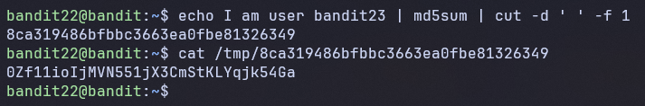

-> Password: `0Zf11ioIjMVN551jX3CmStKLYqjk54Ga`

# Level 23 -> Level 24

Một chương trình đang chạy tự động định kì từ `cron`, trình lập lịch tác vụ dựa trên thời gian. Hãy xem cấu hình trong `/etc/cron.d/` và xem lệnh nào đang được thực thi

```
bandit23@bandit:~$ cat /usr/bin/cronjob_bandit24.sh
#!/bin/bash

shopt -s nullglob

myname=$(whoami)

cd /var/spool/"$myname"/foo || exit
echo "Executing and deleting all scripts in /var/spool/$myname/foo:"
for i in * .*;
do
    if [ "$i" != "." ] && [ "$i" != ".." ];
    then
        echo "Handling $i"
        owner="$(stat --format "%U" "./$i")"
        if [ "${owner}" = "bandit23" ] && [ -f "$i" ]; then
            timeout -s 9 60 "./$i"
        fi
        rm -rf "./$i"
    fi
```

Đoạn script thực thi và xóa toàn bộ file trong folder `/var/spool/bandit24`

Vòng lặp `for` duyệt tất cả các file.

Câu lệnh `if` đầu tiên đảm bảo rằng các thư mục `.` và `..` đại diện cho thư mục hiện tại và thư mục trước, thì bỏ qua.

```
if [ "$i" != "." ] && [ "$i" != ".." ];
```

Lấy `owner` của file và xét điều kiện thực thi

```
owner="$(stat --format "%U" "./$i")"
if [ "${owner}" = "bandit23" ] && [ -f "$i" ];
```

Nếu owner là `bandit23`, đoạn script `timeout -s 9 60 "./$i"` được thực thi

Sau đó file sẽ bị xóa
```
rm -rf "./$i"
```
Để khai thác, ta viết 1 script thực hiện lấy mật khẩu của `bandit24`. 

Đầu tiên tạo 1 file trong thư mục `tmp`, điều này giúp ngăn chặn việc xóa tập tin quá sớm và bạn có một bản sao phòng trường hợp xảy ra sự cố. Sau đó chuyển file này vào folder `/var/spool/bandit24`

```
bandit23@bandit:~$ mktemp -d
/tmp/tmp.QLQlGaMrzu

bandit23@bandit:~$ cd /tmp/tmp.QLQlGaMrzu

bandit23@bandit:/tmp/tmp.QLQlGaMrzu$ nano bandit24_pass.sh
```

Nội dung của file:

```
#!/bin/bash

cat /etc/bandit_pass/bandit24 > /tmp/tmp.QLQlGaMrzu/password
```

Set các quyền cho file và folder

```
bandit23@bandit:/tmp/tmp.QLQlGaMrzu$ chmod +rwx bandit24_pass.sh

bandit23@bandit:/tmp/tmp.QLQlGaMrzu$ chmod 777 -R /tmp/tmp.QLQlGaMrzu

bandit23@bandit:/tmp/tmp.QLQlGaMrzu$ touch password

bandit23@bandit:/tmp/tmp.QLQlGaMrzu$ chmod +rwx password
```

Chuyển file vào thư mục `/var/spool/bandit24/foo/`

```
cp bandit24_pass.sh /var/spool/bandit24/foo/
```

Chờ 1 phút và mở file `password` để xem mật khẩu

-> Password: `gb8KRRCsshuZXI0tUuR6ypOFjiZbf3G8`

# Level 24 -> Level 25

Một **tiến trình nền (daemon)** đang lắng nghe trên port `30002` và sẽ đưa cho bạn mật khẩu của bandit25 nếu được gửi mật khẩu của bandit24 và 1 mã pin bí mật gồm 4 chữ số.

Không có cách nào lấy mã pin ngoại trừ việc thử 10000 tổ hợp, được gọi là **brute-forcing**

*Note: Bạn không cần phải tạo connections mới mỗi lần*

Đầu tiên, thử connect với port bằng `nc` để xem response của nó 

```
bandit24@bandit:~$ nc localhost 30002
I am the pincode checker for user bandit25. Please enter the password for user bandit24 and the secret pincode on a single line, separated by a space.
gb8KRRCsshuZXI0tUuR6ypOFjiZbf3G8 0000
Wrong! Please enter the correct current password and pincode. Try again.
```

Ta thấy rằng khi ta gửi sai mã pin, ta nhận được một dòng phản hổi

Viết 1 script thực hiện gen ra toàn bộ tổ hợp có thể của mã pin sau đó gửi cho port 30002:
```
#!/bin/bash

for i in {0000...9999}
do
    echo gb8KRRCsshuZXI0tUuR6ypOFjiZbf3G8 $i >> pass.txt
done

cat pass.txt | nc localhost 30002 > result.txt
```

- Vòng lặp `for` tạo ra các giá trị từ 0000 -> 9999 và tạo input gửi cho server

- Với mỗi `i`, script sẽ ghi vào file 1 payload như sau: `UoMYTrfrBFHyQXmg6gzctqAwOmw1IohZ 0000`

-> File `pass.txt` chứa 10000 dòng input hợp lệ

- Gửi toàn bộ input vào server và lưu response vào file `result.txt`

Tạo 1 thư mục tạm và lưu script, set quyền và thực thi script đó
```
bandit24@bandit: mktemp -d
/tmp/tmp.Z5UCymBowE$

bandit24@bandit: cd /tmp/tmp.Z5UCymBowE$

bandit24@bandit:/tmp/tmp.Z5UCymBowE$ nano script.sh

bandit24@bandit:/tmp/tmp.Z5UCymBowE$ chmod +x script.sh

bandit24@bandit:/tmp/tmp.Z5UCymBowE$ ./script.sh
```

Sau khi chạy script, sẽ có 2 file được tạo là `pass.txt` và `result.txt`

Lọc nhanh kết quả: `grep -v "Wrong" result.txt` và thu được mật khẩu

```
bandit24@bandit:/tmp/tmp.Z5UCymBowE$ grep -v "Wrong" result.txt
I am the pincode checker for user bandit25. Please enter the password for user bandit24 and the secret pincode on a single line, separated by a space.
Correct!
The password of user bandit25 is iCi86ttT4KSNe1armKiwbQNmB3YJP3q4
```

-> Password: `iCi86ttT4KSNe1armKiwbQNmB3YJP3q4`

